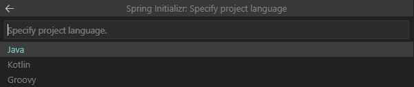
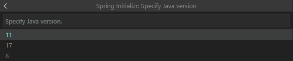

## 📓 Summry
spring boot 프로젝트시 Intellij나 Eclipse를 IDE로 사용하는 방법도 있지만 VS Code를 선호하는 사람들을 위해 VS Code에서 spring boot 기반 java application을 개발할 수 있는 환경을 구축하는 방법을 소개합니다.

### ❓ Spring Boot란
스프링 프레임워크 기반 프로젝트를 복잡한 설정없이 쉽고 빠르게 만들어주는 라이브러리입니다. 사용자가 일일이 모든 설정을 하지 않아도 자주 사용되는 기본설정을 알아서 해줍니다.

<br />

## 🎈 사전준비

### 1. Visual Studio Code 설치
[여기](https://code.visualstudio.com/download)를 눌러 다운로드 후 설치해 주세요!

### 2. Java Development Kit(JDK) 설치

JDK가 설치되어 있어야 합니다. cmd에 아래 명령어를 입력후 Java 설치 여부를 확인해 주세요!
> JDK 버전은 8 이상(11이상 권장)을 설치해야 합니다.

```bash
# version check
$ java -version
```

<br />

## ⚡ plugin install
VS Code에서 단축키 `Ctrl + Shift + X`를 사용해 Extension Marketplace를 패널을 띄웁니다.

### 1. Extension Pack for Java
> Java 응용 프로그램을 작성, 테스트 및 디버그하는 데 도움이 될 수 있는 널리 사용되는 확장팩입니다.
[VS Marketplace 링크](https://marketplace.visualstudio.com/items?itemName=vscjava.vscode-java-pack)


### 2. Spring Boot Extension Pack
> Spring Boot 애플리케이션 개발 및 배포를 위한 확장팩입니다.
[VS Marketplace 링크](https://marketplace.visualstudio.com/items?itemName=Pivotal.vscode-boot-dev-pack)


### 3. Lombok Annotations Support for VS Code
> Java 라이브러리로 반복되는 getter, setter, toString .. 등의 반복 메서드 작성 코드를 줄여줍니다.
[VS Marketplace 링크](https://marketplace.visualstudio.com/items?itemName=GabrielBB.vscode-lombok)


<br />

## 🤖 create project
이제 프로젝트를 생성해 보겠습니다.

1. Create a Maven Project
> VS Code에서 `Ctrl + Shift + P`를 사용해 `Spring initalizr: Create a Maven Project` 선택


2. Spring Boot Version
> `2.5.4 이상`을 선택


3. Specify project language
> `Java` 선택



4. Input Group Id
> `com.example` 입력


5. Input Artifact Id
> 프로젝트 이름을 적어 주세요. 여기서는 `demo`라고 하겠습니다.


6. Specify packaging type
> `War` 선택


7. Specify Java version
> 설치되어있는 `Java 버전`을 선택해 주세요! <br />
> `cmd`창에 `java -version`을 입력해서 확인할 수 있습니다.



8. Choose dependencies
> `Lombok`, `Spring Web` 2개를 선택


9. 저장소 선택
> 프로젝트가 생성될 위치를 지정해 주세요.


10. Finish!! 🙌

<br />

## 🖲 test code 작성
프로젝트를 실행하기에 앞서 web에서 확인이 가능하도록 sample page를 생성하려고 합니다.

> `/demo/src/main/resources/static`안에 `index.html`파일을 생성합니다.


> `index.html` 코드는 아래와 같습니다.
```html
<!DOCTYPE html>
<html lang="en">
<head>
    <meta charset="UTF-8">
    <meta http-equiv="X-UA-Compatible" content="IE=edge">
    <meta name="viewport" content="width=device-width, initial-scale=1.0">
    <title>Document</title>
</head>
<body>
    hello world!!
</body>
</html>
```

<br />

## 🚀 프로젝트 실행하기
> cmd에서 프로젝트가 생성된 위치로 이동해 아래 코드를 실행합니다.

```bash
./mvnw spring-boot:run
```

<br />

> `http://localhost:8080`으로 접속하면 `hello world!!` 문자열을 확인할 수 있습니다. 🙋‍♂️


```toc

```
